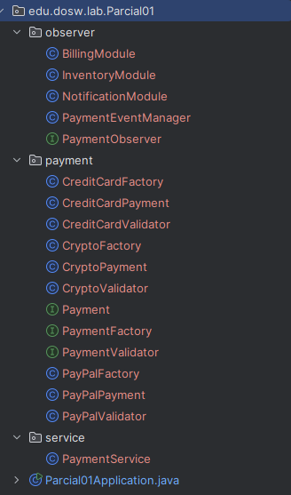
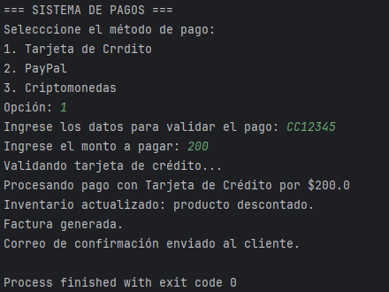
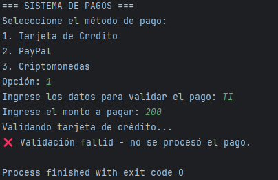
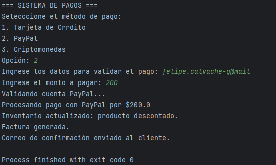
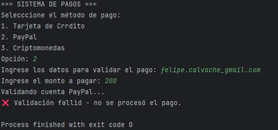
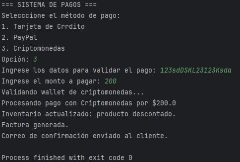
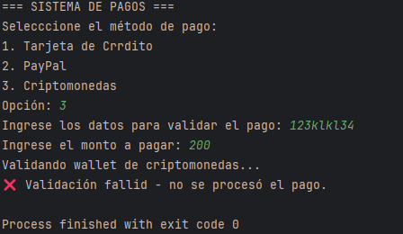
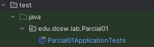
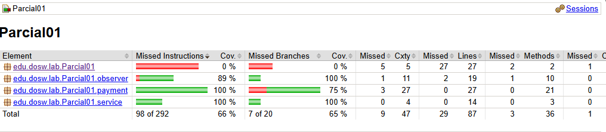

# Parcial primer corte - Felipe Calvache

## Solución parcial
## 4. Patrones de diseño
### Primer patrón
 a) Nombre del patrón: Factory Method

 b) Tipo de patrón: Creacional

 c) Argumentación: El patrón Factory Method se utiliza para permitir la creación de objetos sin necesidad de especificar la clase exacta del objeto que será creado. En el caso de este sistema de pagos, al momento de ejecutar el sistema, no se sabe qué tipo de método de pago se utilizará ya que puede ser tarjeta de crédito, Paypal o criptomoneda, pero se necesita una forma flexible de crear instancias de estos métodos de pago sin que la lógica principal del sistema esté sujeta a clases específicas.

El Factory Method se refleja en la interfaz PaymentFactory, que es responsable de crear objetos de tipo Payment. La interfaz Payment es implementada por diferentes clases de pago (TarjetaCredito, PayPal, Criptomoneda). La clase PaymentFactory usa la lógica de selección del tipo de pago en función del parámetro que se le pase, y crea el objeto adecuado sin que la lógica del cliente tenga que preocuparse por el tipo exacto de pago que está utilizando.

### Segundo patrón
a) Nombre del patrón: Observer

b) Tipo de patrón: Comportamiento

c) Argumentación: El patrón Observer se utiliza cuando uno o más objetos necesitan ser notificados de un cambio en el estado de otro objeto. En este caso, una vez que el pago ha sido procesado correctamente, varios módulos del sistema necesitan reaccionar de forma independiente a ese evento de pago que ocurrió. Cada uno de estos módulos debe ser notificado de que el pago fue exitoso, sin que el sistema principal tenga que preocuparse por las dependencias entre estos módulos.

El patrón Observer está reflejado en las clases Payment que está actuando como subject y las clases que implementan PaymentObserver. Payment mantiene una lista de observadores y cuando el pago se procesa, notifica a todos los observadores registrados.

## 5. Desarrollo del código
Básicamente empezamos a crear la lógica del problema, para que pueda entender cómo organicé el código y todo eso he organizado el código en tres paquetes principales: payment, observer y service, siguiendo principios de diseño como SOLID y aplicando patrones de diseño (Abstract Factory y Observer).

También yo definí una regla para cada validador dependiendo del pago, por ejemplo:

Para tarjeta de crédito definí que debe empezar con 'CC' para que sea válido.

Para PayPal definí que tiene que tener un arroba ya que normalmente las cuentas de PayPal están asociadas con un correo.

Para Criptomoneda la verdad no sé mucho de eso entonces simplemente puse que debe tener una longitud mayor a 10 para que sea válido.

Ahora vamos con los paquetes:

Paquete payment: En este paquete se encuentran todas las clases relacionadas con los métodos de pago y decidí dejar que cada método de pago tenga su propia Factory para que no se dependa de clases concretas, sino de abstracciones.

Paquete observer: En este paquete básicamente lo cree para que se gestione la lógica asociada al patrón Observer, que permite reaccionar automáticamente a los eventos de pago.

Paquete service: Acá prácticamente es dónde va a estar la lógica de diseño del caso de estudio.

### Evidencias de entrada y salida:
Primera opción correcta (Tarjeta de crédito):

Primera opción incorrecta (Tarjeta de crédito):
Cuando intentamos poner tarjeta de identidad

Segunda opción correcta (PayPal):

Segunda opción incorrecta (PayPal): ingresamos un correo sin el arroba

Tercera opción correcta (Crypto):

Tercera opción incorrecta (Crypto): Ingresamos solamente un dígito

## 6. Implementación de pruebas unitarias
Empezamos a crear las pruebas unitarias sobre las clases y métodos para conseguir un 80% de cobertura.

## 7. Análisis de jacoco
Ejecutamos las pruebas unitarias que realizamos y abrimos el index.html que se creo en la carpeta target.

## Ínidce de arranque
Simplemente debes dirigirte a Parcial01Application y desde ahí empezará todo.

